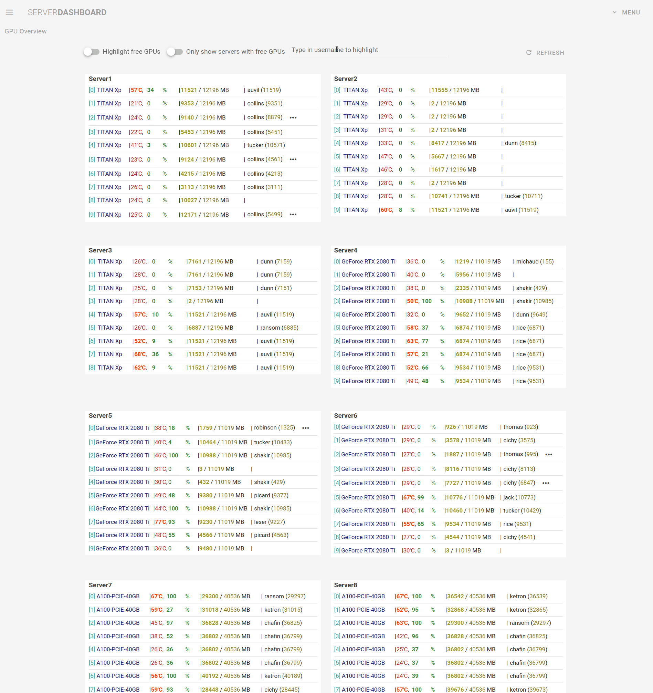

# Server Dashboard
A webapp for monitoring GPU machines. The app aggregates the output from [gpustat](https://github.com/wookayin/gpustat) across all machines and displays them on a single page.  
The frontend is written in [Vue.js](https://vuejs.org/) (+ [Vuetify](https://vuetifyjs.com/en/)) and backend is written in [Flask](https://flask.palletsprojects.com/en/2.0.x/).  
</br>


## About
* The backend uses [paramiko](https://github.com/paramiko/paramiko) to connect to the servers via ssh in order to query the information.
* Each server is queried once per minute (can be changed).
* Multithreading is used to send out the requests to avoid long waiting times.

## Installation
1. Install `Node.js` and `npm` (example given for Ubuntu):
   ```sh
   sudo apt install nodejs
   ```
   ```sh
   sudo apt install npm
   ```
2. Clone the repository:
   ```sh
   git clone https://github.com/matthias-wright/server-dashboard.git
   ```
3. cd into the `frontend` directory:
   ```sh
   cd server-dashboard/frontend
   ```
4. Install node packages:
   ```sh
   npm install
   ```
5. cd into the `backend` directory:
   ```sh
   cd ../backend
   ```
6. Install python packages:
   ```sh
   pip install -r requirements.txt
   ```

## Configuration
1. Add your server addresses to `server-dashboard/backend/config/servers.yaml`:
   ```yaml
   server1:
       hostname: server1.some.domain.com
       active: true
   server2:
       hostname: server2.some.domain.com
       active: true
   ...
   ```
   [gpustat](https://github.com/wookayin/gpustat) needs to be installed on every server you add to the list.
   
2. Add your credentials to `server-dashboard/backend/config/config.yaml`:
   ```yaml
   credentials:
       username: username-for-servers
       path_to_ssh_key: /home/username-local-machine/.ssh/id_rsa
   settings:
       path_to_server_config: config/servers.yaml
       process_timeout: 10
       port: 5000
        
    ```
    The `username` will be used for the ssh requests and `path_to_ssh_key` is the path to the corresponding ssh key. If you currently use a password to login to the servers, you have to generate a ssh key pair and copy your public key to the servers (see [here](https://www.digitalocean.com/community/tutorials/how-to-configure-ssh-key-based-authentication-on-a-linux-server) for more instructions).  
    Don't use `~` for `path_to_ssh_key`, write out the full path.  
    `process_timeout` is the time in seconds to wait for a server to respond and `port` is the port for the Flask app. You don't have to change these.

## Usage
After installing and configurating the app, you can start it as follows:
1. cd into the `server-dashboard` directory:
   ```sh
   cd server-dashboard
   ```
2. Run the `run.py` script:
   ```sh
   python run.py
   ```
The app should be available at: http://localhost:8080/

## Disclaimer
I have been using the app for a while now and it is working well for me but it has not been extensively tested. If you encounter any problems while setting the app up, don't hesitate to open an issue! 

## Acknowledgements
* I used [this](https://www.youtube.com/playlist?list=PL4cUxeGkcC9g0MQZfHwKcuB0Yswgb3gA5) awesome tutorial by [The Net Ninja](https://www.youtube.com/c/TheNetNinja) to learn Vuetify.
* [gpustat](https://github.com/wookayin/gpustat) is used to obtain the GPU information from each separate machine.
